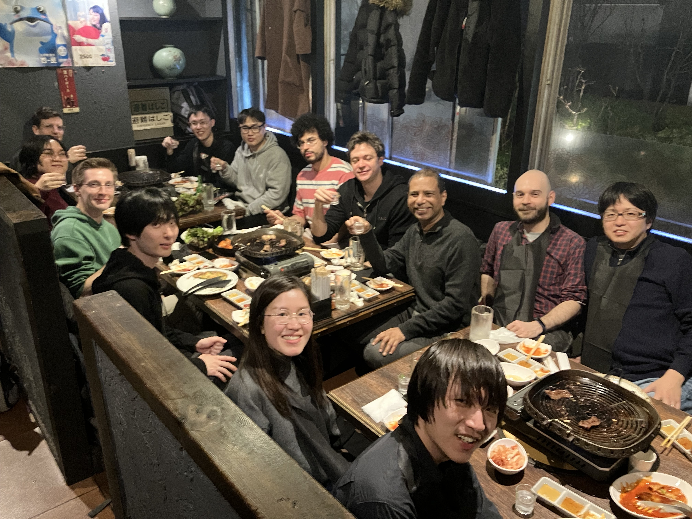
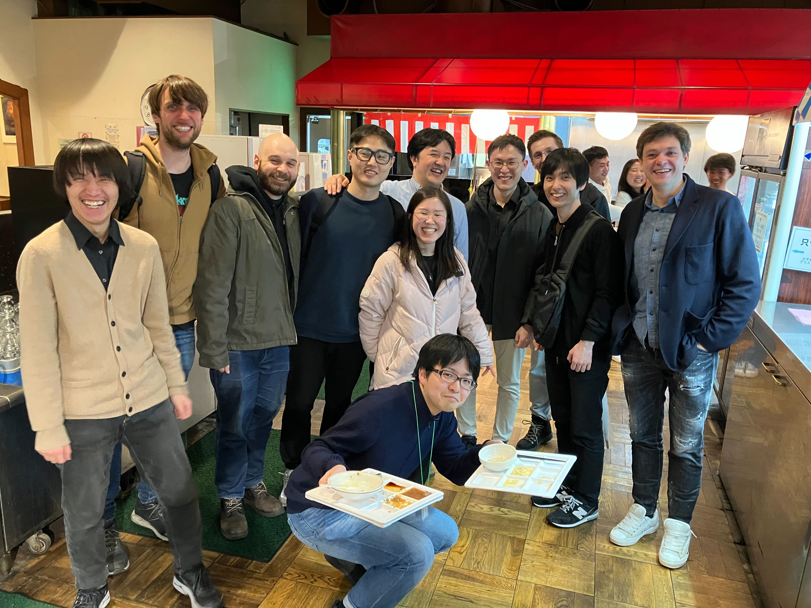
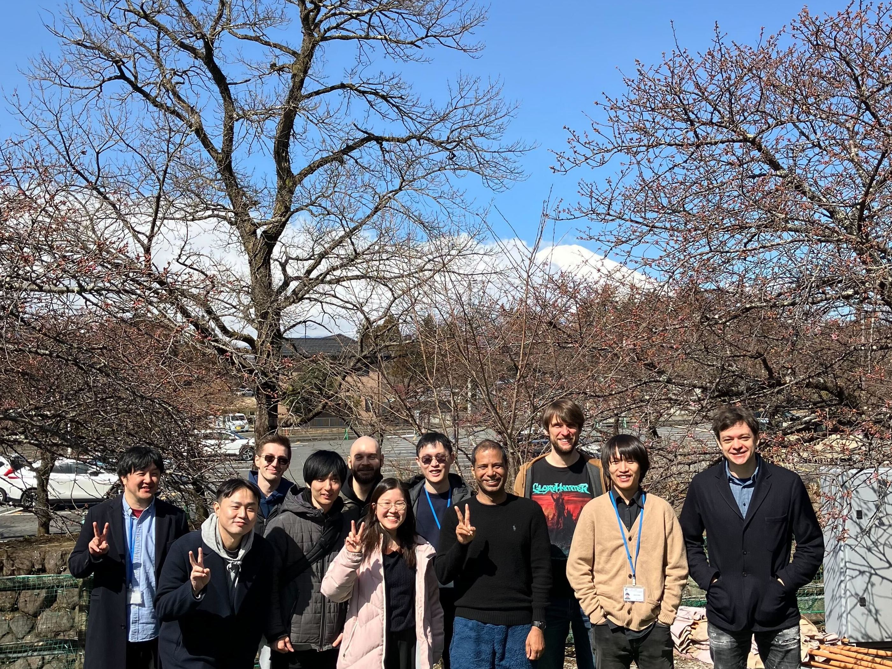

The Approximate Bayesian Inference Team is a diverse group of people that
encourages a multi-cultural environment. We think this is a key ingredient for any successful workplace,
even more so for research.
We are committed to establishing a welcoming environment for people of any
background, and as such we encourage applications from any minority.

If you are interested in joining us, please [check the news](../news/) for open positions or see
[here](../vacancies/) for available RIKEN programmes.

<section class="page__content cf">

  
  
  
    
    
      
    
  

</section>

<section class="page__content cf">
<h1>Alumni</h1>
<h2>Research Scientists</h2>
<table class="responsive-table table">
  <tr>
    <th>Name</th>
    <th>Dates</th>
	<th>Next Destination</th>
  </tr>
  
  
    
      <tr>
        <td>{{ post.title }}</td>
        <td>{{ post.date | date: '%m/%y' }}-{{ post.date_leave | date:'%m/%y' }}</td>
		<td>{{ post.wentto }}</td>
      </tr>
    
  
</table>
 
<!--  -->

<h2>Postdoctoral Researcher</h2>
<table class="responsive-table table">
  <tr>
    <th>Name</th>
    <th>Dates</th>
	<th>Next Destination</th>
  </tr>
  
  
    
      <tr>
        <td>{{ post.title }}</td>
        <td>{{ post.date | date: '%m/%y' }}-{{ post.date_leave | date: '%m/%y' }}</td>
        <td>{{ post.wentto }}</td>
      </tr>
    
  
</table>

 * Special Postdoctoral Researcher 

 
<!--  -->
<h2>Research Assistants</h2>
<table class="responsive-table table">
  <tr>
    <th>Name</th>
    <th>Dates</th>
	<th>Next Destination</th>
  </tr>
  
  
    
      <tr>
        <td>{{ post.title }}</td>
        <td>{{ post.date | date: '%m/%y' }}-{{ post.date_leave | date: '%m/%y' }}</td>
        <td>{{ post.wentto }}</td>
      </tr>
    
  
</table>
 
<!--  -->
<h2>Interns / Trainees / Remote Collaborators / Rotation Students </h2>
<table class="responsive-table table" font-size="1em">
  <tr>
    <th>Name</th>
    <th>Dates</th>
    <th>Affliation</th>
    <th>Next Destination</th>
  </tr>
  
  
    
      <tr>
        <td>{{ post.title }}</td>
        <td>{{ post.date | date: '%m/%y' }}-{{ post.date_leave | date: '%m/%y' }}</td>
        <td>{{post.affliation}}</td>
        <td>{{post.wentto}}</td>
      </tr>
    
  
</table>

<section>
 
<h1>Group Photos</h1>

<h2> Thomas's Promotion Party, March 2025 </h2>

  

<h2> 2024 AIP Retreat, March 2025 </h2>

  
  

